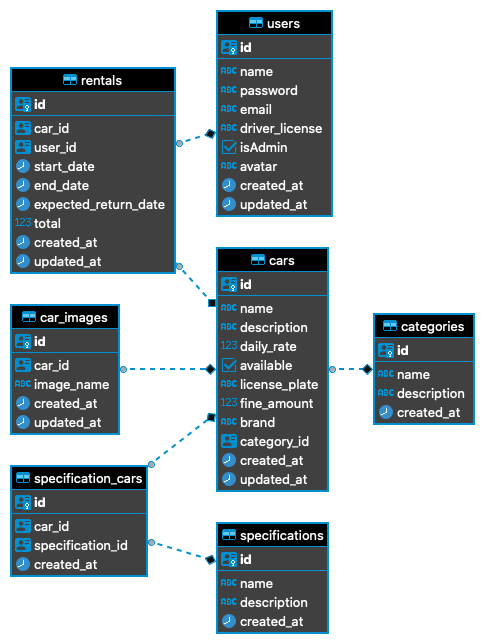

# Rentalx Entities

## Registration Car

  **Functional Requirement**
  🚥

    * [x] it should be able to register car

  **Non-Functional Requirement**
    🏗

     *  the car must be registered by default as avaliable true

  **Business Rules**
    💼

    - [x] it should not be able to register a car with the same license plate exist!
    - [x] it should not be able to change a license plate of a registered car!
    - [x] it should not be able to make a registration of a car without being a user administrator

## List Cars

  **Functional Requirement**
    🚥

    - [ ] should be able to list all cars available
    - [ ] should be able filter the cars by category
    - [ ] should be able filter the cars by brandy
    - [ ] should be able filter the cars by name

  **Business Rules**
    💼

    * the user needs this logged into the system

## Register Specification Car

  **Functional Requirement**
    🚥

    - [ ] it should be able create specification car
    - [ ] it should be able list all specification
    - [ ] it should be able list all cars

  <!-- **Non-Functional Requirement**
    🏗

    *   -->

  **Business Rules**
    💼

    - [ ] it should not be able to create a specification with car nothing exist!
    - [ ] it should not be able to create an existing specification for the same car!
    - [ ] it should not be able to make a registration of a car without being a user administrator

## Registration Car Image

  **Functional Requirement**
  🚥

    - [ ] it should be able to register an image to a car

  **Non-Functional Requirement**
    🏗

    - [ ]  use multer for image upload

  **Business Rules**
    💼

    - [ ] it should not be able to register an image for an unregistered car
    - [ ] it should is able to save more than one image in the seat for a car
    - [ ] it should not be able to make a registration of a car without being a user administrator

## Car Rental

  **Functional Requirement**
  🚥

    - [ ] it should be able to resgister rent
  
  <!-- **Non-Functional Requirement**
    🏗

    *   -->

  **Business Rules**
    💼

    - [ ] it should be have a minimum duration of 24 hour
    - [ ] it should not be possible to open a new rental if the user already has a rental in progress

<!-- ## Registration Car Image

  **Functional Requirement**
  🚥

    * 

  **Non-Functional Requirement**
    🏗

    *  

  **Business Rules**
    💼

    * 
   -->
